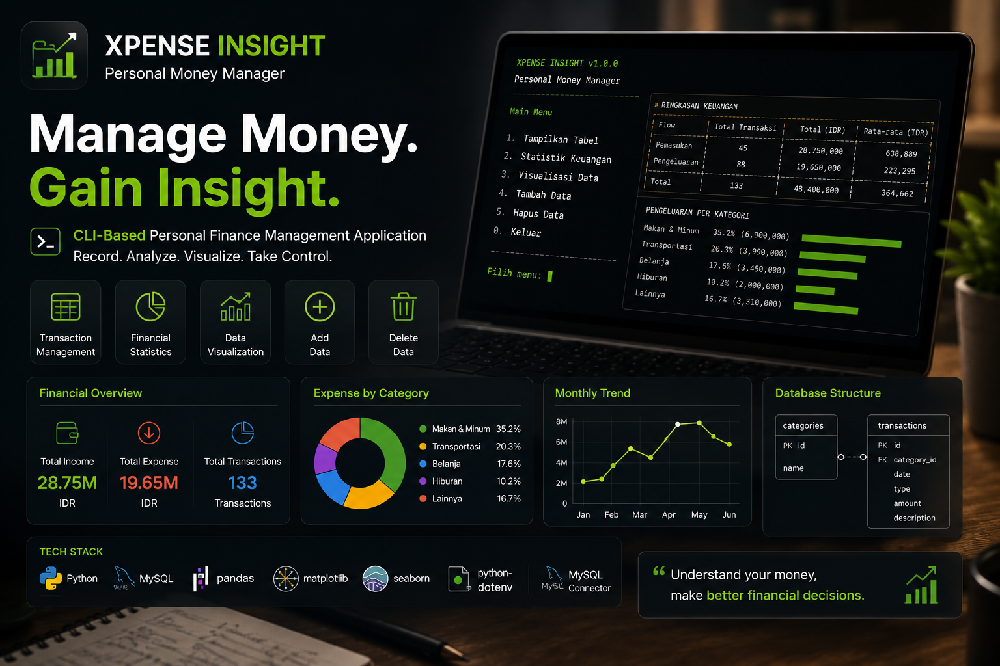

# Xpense Insight

<p align="center">
  
</p>

A CLI application for recording and analyzing personal finances.
Built with Python and MySQL, featuring transaction management, statistics, and data visualization.

---

## Features

- Display Tables - View category and transaction data
- Statistics - COUNT, SUM, AVG summary per flow and category
- Visualization - Financial data visualization charts
- Add Data - Add new transactions and categories
- Delete Data - Delete transactions and categories

---

## Project Structure
```
m1-personal-money-manager/
    main.py                         <- entry point, run the program from here
    db/
        connection.py               <- MySQL database connection
    utils/
        input_helpers.py            <- validates all user input
        query_helpers.py            <- executes SQL queries (SELECT, INSERT, DELETE)
        formatters.py               <- formats currency (rupiah) and dataframe display
    features/
        table.py                    <- Feature 1: display category & transaction tables
        statistic.py                <- Feature 2: COUNT, SUM, AVG statistics
        visualization.py            <- Feature 3: data visualization charts
        add_data.py                 <- Feature 4: add transactions and categories
        delete_data.py              <- Feature 5: delete transactions and categories
    m1_capst_money_manager.sql      <- database schema + 100 seed transactions
    requirements.txt                <- list of required libraries
    .env                            <- database credentials (not pushed to GitHub)
```

---

## How to Run

### Prerequisites
- Python 3.11+
- Active MySQL Server

### Step 1 - Clone the Repository
```bash
git clone https://github.com/daffaalhanif/m1-personal-money-manager.git
cd m1-personal-money-manager
```

### Step 2 - Create and Activate a Virtual Environment
```bash
python -m venv .venv
```

Mac/Linux:
```bash
source .venv/bin/activate
```

Windows:
```bash
.venv\Scripts\activate
```

### Step 3 - Install Dependencies
```bash
pip install -r requirements.txt
```

### Step 4 - Import the Database into MySQL
```bash
mysql -u root -p < m1_capst_money_manager.sql
```

Or open MySQL Workbench and run the `m1_capst_money_manager.sql` file manually.

This file automatically creates the `m1_capst_money_manager` database along with its tables and 100 seed transactions.

### Step 5 - Create a .env File
Create a new file named `.env` in the root folder with the following content:
```env
DB_HOST=localhost
DB_USER=root
DB_PASSWORD=your_mysql_password
DB_PORT=3306
DB_NAME=m1_capst_money_manager
```

Adjust `DB_USER` and `DB_PASSWORD` to match your MySQL credentials.

### Step 6 - Run the Program
```bash
python main.py
```

---

## Tech Stack

- Python 3.11+  : Main programming language
- SQLAlchemy    : Database connection and query execution
- pandas        : Data manipulation and display
- matplotlib    : Chart visualization
- seaborn       : Visualization styling
- python-dotenv : Loads configuration from .env
- mysql-connector-python : MySQL driver
